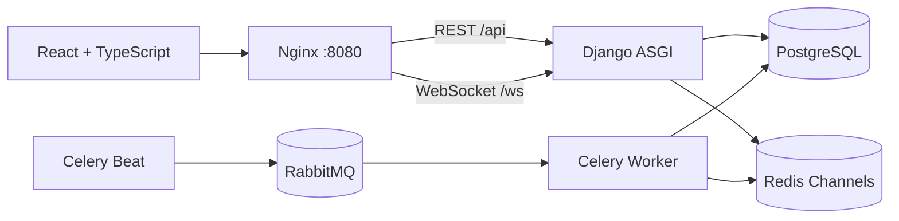

# EchoMessenger System - Phase 1

Systems Analysis and Design Course Project -- Sharif University of
Technology -- Spring 2026

## Project Introduction

This repository contains the documentation for Phase 1 of the analysis
and design of the **EchoMessenger** messaging platform (similar to
Discord). The goal of this phase is to accurately gather system
requirements, design the foundational architecture, create analysis
diagrams, and prepare the initial user interface designs.

## Development Team

-   Sina Mohammadi -- Product Owner
-   Mohammad Ermia Ghaseri -- Scrum Master
-   Mehrshad Valizadeh Arjmand -- Data & Backend Analyst
-   Amir Mohammad Shahrezaei -- Infrastructure Analyst
-   Amir Hossein Ghasemipour -- Wire-Frame Designer
-   Nima Notghi -- System Architect & QA

## Folder Structure

-   **docs/**: Text documentation including requirements, methodology,
    and technologies.
-   **diagrams/**: PlantUML source files and images for ERD, Use Case,
    and Sequence diagrams.
-   **wireframes/**: Images of the initial user interface designs.


# EchoMessenger

A complete Discord-like messaging product for the Systems Analysis and Design
course at Sharif University of Technology (Spring 2026).

This repository preserves the Phase 1 report, diagrams, and wireframes and
implements them as a tested full-stack product. It includes every mandatory
requirement and both bonus requirements.

## What is implemented

- Registration, email login, logout, and editable profiles
- Unique user-to-user direct chats
- Private groups with invite privacy and member management
- Channels with named topics
- Database-backed custom roles and editable capabilities
- Text, image, video, audio, and general-file messages
- Sender-only edit and permission-aware delete
- Per-chat and per-topic message search
- Persistent read/unread notifications
- **Bonus:** live messages and notifications over authenticated WebSockets
- **Bonus:** restart-safe scheduled messages with Celery and RabbitMQ

Controls shown only as generic Phase 1 placeholders, such as SSO and voice
chat, are intentionally not presented as unfinished features.

## Architecture

EchoMessenger is a modular monolith with independently deployed runtime
processes:



The backend is split into clear `accounts`, `spaces`, `messaging`,
`notifications`, and `common` modules. REST owns validated writes; WebSockets
deliver committed events. PostgreSQL remains authoritative for both messages
and pending schedules.

## Quick start

### Requirements

- Docker Desktop or Docker Engine with Compose v2
- About 2 GB of available memory for the complete local stack

### Run

```bash
cp .env.example .env
docker compose up --build -d
docker compose exec backend python manage.py seed_demo
```

Open [http://localhost:8080](http://localhost:8080).

The backend container waits for its dependencies, applies migrations, and
collects static files automatically. `seed_demo` is idempotent and may be run
again safely.

### Demo accounts

All demo accounts use password `DemoPass123!`.

| Username | Email | Suggested use |
|---|---|---|
| `alice` | `alice@example.test` | Channel/group owner |
| `bob` | `bob@example.test` | Moderator and live-chat second user |
| `carol` | `carol@example.test` | Regular role and restriction checks |
| `dave` | `dave@example.test` | Invite-privacy demonstration |

For the best demo, open a normal window as Alice and a private window as Bob.
Enter their direct chat, send a message from Alice, and watch it appear for Bob
without refresh. Then schedule a short-future message, close Alice's window,
and show that Bob still receives it.

## Useful commands

```bash
make up             # build and start the product
make logs           # follow service logs
make seed           # ensure deterministic demo content exists
make test           # isolated backend and frontend test containers
make check          # Django configuration and migration drift
make smoke          # public HTTP health and SPA checks
make down           # stop containers without deleting data
```

Local backend verification without Docker:

```bash
cd backend
python -m venv .venv
. .venv/bin/activate
pip install -r requirements-dev.txt
pytest
ruff check .
python manage.py makemigrations --check --dry-run
python manage.py check
```

Local frontend verification:

```bash
cd frontend
npm ci
npm run lint
npm test
npm run build
```

## Core behavior

### Spaces and topics

- `DIRECT` spaces have exactly two users and a canonical pair key, so opening
  the same person twice reuses one conversation.
- `GROUP` spaces are simple multi-user conversations.
- `CHANNEL` spaces contain topics such as `General` or `Announcements`; each
  channel message must select a topic.

### Roles

Channel roles store these capabilities in PostgreSQL:

- send messages;
- send media;
- manage topics;
- manage members;
- delete other messages;
- manage roles;
- manage the space.

Owners implicitly have every capability. The server prevents a manager from
creating or assigning a role with permissions that manager does not possess.
Changing a role therefore changes access without changing source code.

### Files

A message may contain text, one to five attachments, or both. The default limit
is 10 MiB per attachment. Storage names are randomized, file categories are
validated, and downloads require current space membership. Deleting a message
also removes its stored attachment bytes.

### Scheduled delivery

Future messages are stored as `PENDING`. Celery Beat scans due rows every five
seconds, and a worker atomically rechecks membership, topic, and media
permissions before changing a row to `SENT`. Repeated task execution cannot
send the same row twice.

## Security highlights

- HttpOnly same-origin sessions and CSRF on every unsafe request, including
  registration and login
- Django password hashing and validation
- Object-level membership/role checks
- WebSocket origin validation and membership recheck before every event
- Protected attachment downloads, randomized paths, and `nosniff`
- DRF and Nginx request throttling
- Production HTTPS/cookie settings and secrets controlled by environment
- Plain-text React rendering for all user-generated text

See [the security notes](docs/phase2/security.md) for the complete checklist.

## Repository layout

```text
backend/                   Django, DRF, Channels, Celery, tests, migrations
frontend/                  React, TypeScript, Vite, Vitest
nginx/                     Production gateway and SPA build
scripts/                   Entrypoint, dependency wait, and smoke checks
docs/phase2/               Architecture, API, security, and traceability
docs/iterations/           Three concise Scrum iteration reports
diagrams/                  Original Phase 1 diagrams
wireframes/                Original Phase 1 UI wireframes
FinalReport.pdf            Original Phase 1 consolidated report
Phase2Report.pdf           Formal Phase 2 compliance report
REPOSITORY.txt             Public repository and board addresses
```

## Documentation

- [Implementation contract](docs/phase2/implementation-contract.md)
- [Architecture](docs/phase2/architecture.md)
- [API guide](docs/phase2/api.md)
- [Requirements traceability](docs/phase2/requirements-traceability.md)
- [Security notes](docs/phase2/security.md)
- [Iteration reports](docs/iterations/README.md)
- [Phase 2 report source](docs/phase2/Phase2Report.md)

## Team

| Member | Phase 1 role | Phase 2 area |
|---|---|---|
| Sina Mohammadi | Product Owner | Accounts, profiles, acceptance, traceability |
| Mohammad Ermia Ghaseri | Scrum Master | Spaces, members, topics, iteration workflow |
| Mehrshad Valizadeh Arjmand | Data & Backend Analyst | Schema, messages, files, search, demo data |
| Amir Mohammad Shahrezaei | Infrastructure Analyst | Docker, Nginx, WebSockets, Celery scheduling |
| Amir Hossein Ghasemipour | Wire-Frame Designer | React UI, responsive chat, dialogs |
| Nima Notghi | System Architect & QA | Permissions, integration, tests, CI, final review |

Repository: [Sina-rokna/SD-EchoMessenger](https://github.com/Sina-rokna/SD-EchoMessenger)  
Project board: [GitHub Project](https://github.com/users/Sina-rokna/projects/2/views/1)

