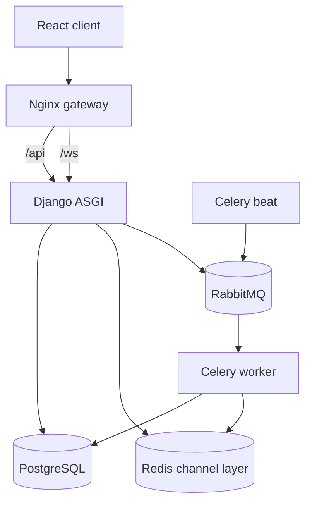

# Phase 2 Architecture

## Decision

EchoMessenger is implemented as a **modular monolith with separate runtime
processes**. The HTTP API, WebSocket consumers, and background worker share one
domain model and one PostgreSQL database, while each concern runs independently
in Docker Compose.

This continues the service-oriented Phase 1 design without creating a network
of small microservices that a six-person course team would have to deploy,
version, and debug separately.

## Backend modules

| Module | Responsibility |
|---|---|
| `accounts` | Registration, session authentication, profiles, avatars, and group-invite preference |
| `spaces` | Direct chats, groups, channels, memberships, topics, custom roles, and permission rules |
| `messaging` | Messages, attachments, edit/delete, search, scheduling state, and realtime events |
| `notifications` | Persistent unread/read notifications and per-user live delivery |
| `common` | Health checks and small cross-cutting utilities |

The modules communicate through explicit services and model references. Views
do not duplicate permission logic, and the browser is never trusted to enforce
authorization.

## Phase 1 model continuity

The six Phase 1 concepts remain intact:

- `User`
- `ChatSpace`
- `Topic`
- `Role`
- `User_ChatSpace`, implemented as `SpaceMembership`
- `Message`

The final schema adds fields and two supporting entities only where an explicit
requirement could not otherwise be represented:

- `DIRECT` is added to `ChatSpace.type` for user-to-user messaging.
- `ChatSpace.owner`, `Message.space`, and `Role.space` make the original ERD
  relationships enforceable.
- `Attachment` represents image, video, audio, and general-file messages.
- `Notification` stores notifications before optional realtime delivery.
- Message status and timestamps represent `PENDING` to `SENT` scheduled flow.
- Role booleans make channel permissions editable without changing code.

## Conversation mapping

- A **channel** is a top-level `ChatSpace` and owns named `Topic` records such
  as `general` and `announcements`.
- A **group** is a simpler multi-user `ChatSpace` and messages do not require a
  topic.
- A **direct chat** is a two-member `ChatSpace`, deduplicated by a canonical
  user-pair key.
- Every message belongs to exactly one space. A channel message additionally
  points to a topic belonging to that same channel.

This mapping preserves the Phase 1 ERD and makes the three-column `#general`
wireframe implementable.

## Realtime delivery

REST requests create, edit, and delete messages. After the database transaction
commits, the backend publishes a typed event to the Redis-backed Channels
layer. Every authenticated browser connected to that space receives the event
without refreshing.

Notifications are persisted first and then sent through a separate per-user
WebSocket. Losing a socket connection therefore does not lose the notification;
the client reloads unread items after reconnecting.

## Scheduled delivery

1. The API validates the sender, destination, topic, content, attachments, and
   future timestamp.
2. It stores the message in `PENDING` state using UTC.
3. Celery Beat requests a due-message scan every five seconds.
4. A worker locks due rows with `select_for_update`, rechecks current membership
   and permission, and changes each valid message to `SENT`.
5. The transaction creates notifications and commits.
6. The worker publishes message and notification events through Redis.

The status transition is idempotent: a retried worker sees a non-pending row and
does not send the same message twice. Because pending state is in PostgreSQL,
delivery survives browser, worker, and broker restarts.

## Security boundaries

- Django session authentication is shared by HTTP and WebSocket requests.
- CSRF protection is required for every unsafe HTTP request.
- WebSocket origin and membership are checked server-side.
- Every object lookup is scoped by membership before content is returned.
- Files use randomized storage names and protected download endpoints.
- Role assignment rejects permissions the acting manager does not possess.
- Production secrets and secure-cookie settings come from environment
  variables.

See [security.md](security.md) for the complete checklist.

## Deployment topology

Docker Compose starts:

- `backend`: Daphne serving Django ASGI
- `worker`: Celery worker
- `beat`: Celery scheduler
- `postgres`: persistent relational database
- `redis`: realtime channel layer
- `rabbitmq`: durable task broker
- `nginx`: deterministic React production build and public entry point on
  port 8080

The Nginx image builds the React client in a Node build stage, serves the
result, proxies `/api/`, upgrades `/ws/`, and applies an upload-size boundary.
The same images and settings are used by every teammate, which satisfies the
Phase 1 repeatable-environment decision.
