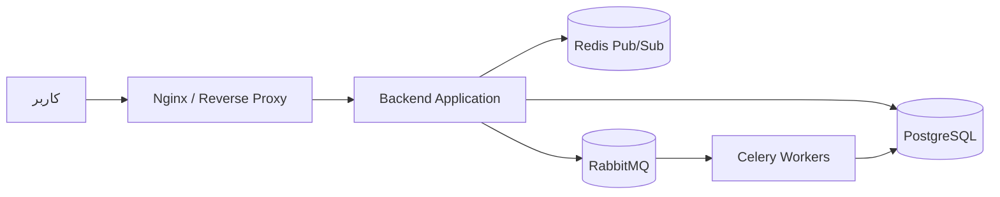

# فناوری‌های انتخاب‌شده و توجیه استفاده

این سند، فناوری‌های اصلی انتخاب‌شده برای توسعه و استقرار سیستم را معرفی می‌کند و دلیل استفاده از هرکدام را توضیح می‌دهد.

---

## خلاصه فناوری‌ها

| بخش | فناوری انتخاب‌شده | دلیل انتخاب |
|---|---|---|
| زیرساخت و محیط اجرا | Docker | یکسان‌سازی محیط توسعه و جلوگیری از تداخل تنظیمات بین اعضای تیم |
| پایگاه داده اصلی | PostgreSQL | مناسب برای داده‌های رابطه‌ای مانند کاربران، فضاها و پیام‌ها |
| ارتباطات بلادرنگ | WebSockets + Redis | پشتیبانی از چت زنده بدون نیاز به Refresh صفحه و توزیع پیام‌ها با Pub/Sub |
| مدیریت وظایف زمان‌بندی‌شده | RabbitMQ + Celery | اجرای پیام‌های زمان‌بندی‌شده و مدیریت صف وظایف |
| وب‌سرور | Nginx | مدیریت ترافیک ورودی و هدایت درخواست‌ها به‌عنوان Reverse Proxy |

---

## 1. زیرساخت و محیط اجرا: Docker

برای جلوگیری از تداخل محیط‌های توسعه بین اعضای تیم و همچنین ساده‌سازی فرایند استقرار، از **Docker** استفاده می‌شود.

با استفاده از Docker، سرویس‌های مختلف پروژه در محیط‌های جداگانه و قابل تکرار اجرا می‌شوند. این موضوع باعث می‌شود همه اعضای تیم بتوانند پروژه را با تنظیمات یکسان اجرا کنند و تفاوت سیستم‌عامل یا نسخه ابزارها باعث ایجاد خطا نشود.

---

## 2. پایگاه داده اصلی: PostgreSQL

با توجه به اینکه داده‌های اصلی سیستم ساختاری کاملاً رابطه‌ای دارند، از **PostgreSQL** به‌عنوان پایگاه داده اصلی استفاده می‌شود.

نمونه‌هایی از داده‌های رابطه‌ای سیستم عبارت‌اند از:

- کاربران
- فضاها
- پیام‌ها
- ارتباط بین کاربران و فضاها

PostgreSQL به دلیل پایداری، امنیت، پشتیبانی مناسب از روابط داده‌ای و قابلیت اجرای Queryهای پیچیده، گزینه مناسبی برای این پروژه است.

---

## 3. ارتباطات بلادرنگ: WebSockets و Redis

برای پیاده‌سازی چت زنده و جلوگیری از نیاز به Refresh کردن صفحه، از **WebSockets** استفاده می‌شود.

WebSockets امکان ایجاد ارتباط دوطرفه و مداوم بین کلاینت و سرور را فراهم می‌کند. بنابراین پیام‌ها می‌توانند بلافاصله پس از ارسال، برای کاربران دیگر نمایش داده شوند.

برای توزیع پیام‌ها بین بخش‌های مختلف سیستم، از قابلیت **Pub/Sub** در **Redis** استفاده می‌شود. Redis کمک می‌کند پیام‌ها سریع‌تر و با تأخیر کمتر بین سرویس‌ها منتقل شوند.

---

## 4. مدیریت وظایف زمان‌بندی‌شده: RabbitMQ و Celery

برای ارسال پیام‌های زمان‌بندی‌شده، از ترکیب **Celery** و **RabbitMQ** استفاده می‌شود.

در این ساختار:

- **Celery** وظایف زمان‌بندی‌شده را اجرا می‌کند.
- **RabbitMQ** نقش صف پیام‌رسان را بر عهده دارد.
- پیام‌ها در زمان مشخص‌شده پردازش شده و در دیتابیس ذخیره می‌شوند.

این ترکیب باعث می‌شود وظایف پس‌زمینه و زمان‌بندی‌شده به شکل منظم، قابل اعتماد و جدا از منطق اصلی برنامه اجرا شوند.

---

## 5. وب‌سرور: Nginx

از **Nginx** به‌عنوان **Reverse Proxy** برای مدیریت ترافیک ورودی استفاده می‌شود.

Nginx درخواست‌های کاربران را دریافت کرده و آن‌ها را به سرویس مناسب هدایت می‌کند. استفاده از Nginx باعث بهبود مدیریت ترافیک، افزایش پایداری سیستم و ساده‌تر شدن فرایند استقرار می‌شود.

---

## نمای کلی معماری

---

## جمع‌بندی

انتخاب این فناوری‌ها با هدف ایجاد سیستمی پایدار، قابل توسعه، قابل استقرار و مناسب برای ارتباطات بلادرنگ انجام شده است.

استفاده از Docker محیط توسعه و اجرا را یکپارچه می‌کند، PostgreSQL داده‌های رابطه‌ای سیستم را مدیریت می‌کند، WebSockets و Redis ارتباطات زنده را ممکن می‌سازند، RabbitMQ و Celery وظایف زمان‌بندی‌شده را اجرا می‌کنند و Nginx مدیریت ترافیک ورودی را بر عهده می‌گیرد.
